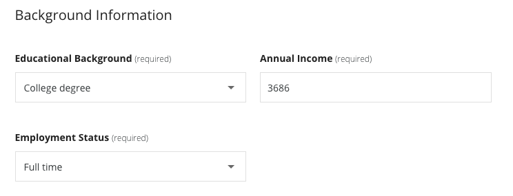
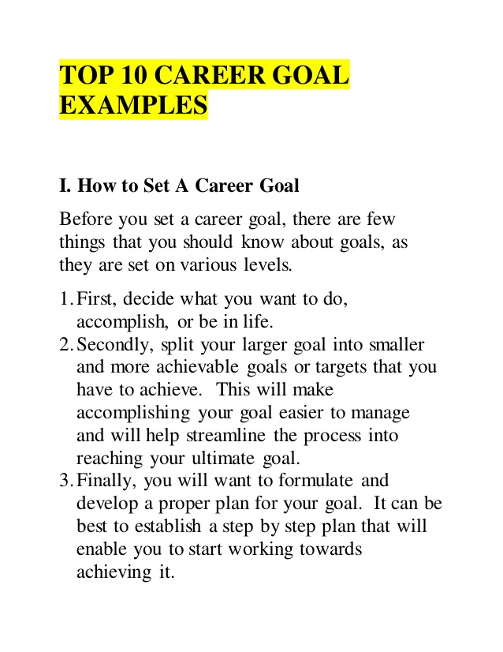

# Financial Aid
 

I agree to the terms above 

## Background Information

  
ask 
 
per month 

# Why are you appliying for Financial Aid?

> I was born and live in Shenyang City, China. I got about 2000 CNY per month, transportation takes me 300, the most cheap meal is 15 and 3 meals together per month will be 1350. I also need to pay for the house, electric gas water... we need to pay for water in China... the small amount  of income is not even enough for each month. What to do? You are right, beg money from parents. After some humiliation and complain I can get some. Without dignity. I live in a city has snowy and cold winter, extra money to keep warm too. It is dreadful even to write these situations down. Life is difficult right? But I need to move on. But I still keep studying every day, I want to change my life. I want to live with dignity. I want a job with higher income. But I can not afford to pay the fee. That's why I ask for financial aid. That's why I am applying for a scholarship.

## for C C++ Linux
> I always want to become a c programmer, because c has a lot of chance to interact with hardware. C is the first programming language I met in college.My interest to  programming start long time ago, since college, but until now, I find Coursera and start to find ways to learn. I am a learner that want to solve complex problems by writing computer programs. I will learn to develop algorithms in a systematic way and read and write the C code to implement them. In course 1 programming fundamentals I can learn some knowledge about algorithms, about memory management, control structure, data types. In course 2 I can learn about writing running and fixing code in c, emacs, git and github version control system, unix commands, hello world, make makefile, I can learn how to use a lot of powerful tools in linux and c. In course 3 I can learn about pointers, from basic swap to const to pointer arithmetic, I will also learn some memory check tools. I will learn arrays which is basicly pointers, strings and recursion. In course 4 interacting with the system and managing memory, I am going to learn some more complex topic like fgetc fgets, file open and read, dynamic memory allocation, finally a pocker project. In the course Linux Server Management and Security, I can learn more about linux. I want to become a Linux C programmer, with C and Linux I have learned, with some windows server skills to enhance, this will help me to achieve my career goals.

## >> for CPA
> I have applied for CICPA exam and Financial Accounting, Managerial Accounting, Corporate Finance, Taxation and other related courses are made up the CPA exam. I try my best to find the courses online, the courses in Chinese are boring and tedious, some of them are even paid, but totally not worth the price. Finally I found Coursera and the business courses. They are easy to understand, relax and happy. The professor is no longer over-enthusiastic like in North Korea news or like a propaganda. English has been my first language to learn for long time, and I am prepared to use it to prepare the CPA exam. My major at collage is Financial Management and I want to have a closure of my four years. AICPA are better choice but I do not have budget to apply. So get knowledge in English and take the CICPA exam. It will work! Thank you Coursera Guys and Ladies. Be a crossover specialist. That’s my career goal.

## >> for graphic design
> I used to work in Graphic Design Field. I love design job, but the chances in this city is so little and I need to start my career in another city. Typography is the art of manipulating the visual form of language to enrich and control its meaning. It’s an exciting space for invention and expression. And I am going to learn and explore the expressive, meaningful potential of type. In image making course, I will explore images to expand my visual vocabulary. I will invite the images to deliberately carry meaning and communication through relational moves. How to make image, that’s what I am looking for and prepared to learn. Graphic Design is everywhere, all around us. Through visual examples, I will learn the fundamental principles of graphic design. All the topics in this field. I can learn from the faculty, such an honor. At last but not least, is the History of graphic design, a lot of knowledge and concepts. I am so excited, I want to learn these topics so bad. Better knowledge better future!

## >> for android development

>  Java is the first programming language I have learn, and one of the best. The most popular application is Java Web, but there is no course about it on coursera. The one and only Java Appliance on coursera may or may not be Android. There is a lot of courses and specialization about Android development, from software to hardware. There is Java for Android from Vanderbilt University, there is Programming Mobile Applications for Android Handheld Systems: Part i and Part ii, from University of Maryland College Park. There is even some nice course in other languages like Spanish called Programando con Java para aplicaciones Android by Universidad Nacional Autonoma de Mexico. I have just searched for job opportunities on some local websites, there is chances about Android Develop, and the salary is not that bad. To get a better job and work as a programmer is always my dream, these lovely courses will help me to built my dream to learn Android Courses.

# How will taking this course help you achieve your career goals?

## >> for java EPFL

> Java is a general purpose computer programming language that is classed based, object oriented, and is widely used in a lot of fields. The course I will take is created by EPFL, which is a university from Switzerland. French is the main language using in the course. I have admire french for a long time, if I can combine french and programming together, that will be fantastic. another interesting thing is the course is designed and split into two parts, non objected oriented c styled part and object oriented part. Every topic will covered here like constructers, heritage, polymorphism, static, interface, exceptions. After complete this course I can get a better understand of Java and learn some french by the way. I always dreaming about to programming and to change the world with my codes. My career goal is to switch to programming work. With the Knowledge and skills of Java taught here, I can achieve my career goals .

## >> for java lyon

>  Java is a general purpose computer programming language that is classed based, object oriented, and is widely used in a lot of fields. The course I will take is created by emlyon business school, which is a university from France. English is the main language using in the course. I have admire french for a long time, the course is taught in English which is the language I know, that will be fantastic. another interesting thing is the course is designed and split into two parts, non objected oriented c styled part and object oriented part. Every topic will covered here like constructers, heritage, polymorphism, static, interface, exceptions. After complete this course I can get a better understand of Java and learn some french by the way. I always dreaming about to programming and to change the world with my codes. My career goal is to switch to programming work. With the Knowledge and skills of Java taught here, I can achieve my career goals .

## >> for korean

>  A language is the key to a particular culture. And there is so much fun within the process of learning a new language. I can explore the splendid culture of these people, I can learned the way they live and think, I can find a different way to see things, a different point of view. Korean is an advanced country in economy, it’s culture is intresting and sophisticated, the science and technology is higly developed, a large amount of global companies are from this land, for instance samsung electronics, lg electronics, sk communications, hyundai motors, kia motors, naver.com, and so on. Korean people are downplayed at the same time ardour in life and work, hardworking diligent courageous brave and industrious. In the future, north korea will open its gate and welcome people from all around the world. I hope I can be one of those people that explore the beautiful land. There can be miracles, I hope I am the one that make it happens. Korean language will help me to achieve my career goals.

**How will taking this course help you achieve your career goals?** (150 words minimum required)

## por >> Cisco specialization

> My career goal is to find a job in information tech and computer science field.  I had study financial management at  college. My job will be changed to a different field. I need to learn some basic courses about computers and programming. **In this course I will learn** about how data networks work, how to use Cisco packet tracer, Ethernet protocols, DNS, HTTP, HTML, SMTP, TELNET, SSH, definitions of the ipv4 addressing system, IPv6 and NAT, lan, how wifi communication is implemented, physical mac address, learn how to build a secure home network, network security, about cisco devices, how to use Cisco CLI commands, about Cisco routers. Cisco is a global company, it is known for networking hardwares and telecommunications equipments. The course is developed by Cisco. **After all these Knowledge I have learned,**  I can start looking for positions like IT support, I can achieve my career goals with the help of this particular Coursera course.

## por >> SQL
How will taking this course help you achieve your career goals? 

## title

> content

word counter
https://wordcounter.net
https://wordcounter.io

blepharoplasty: /`blaw.fur.  a.plus.tee/, double eye-lid surgery
https://www.youtube.com/watch?v=tpwjeRMvwnM